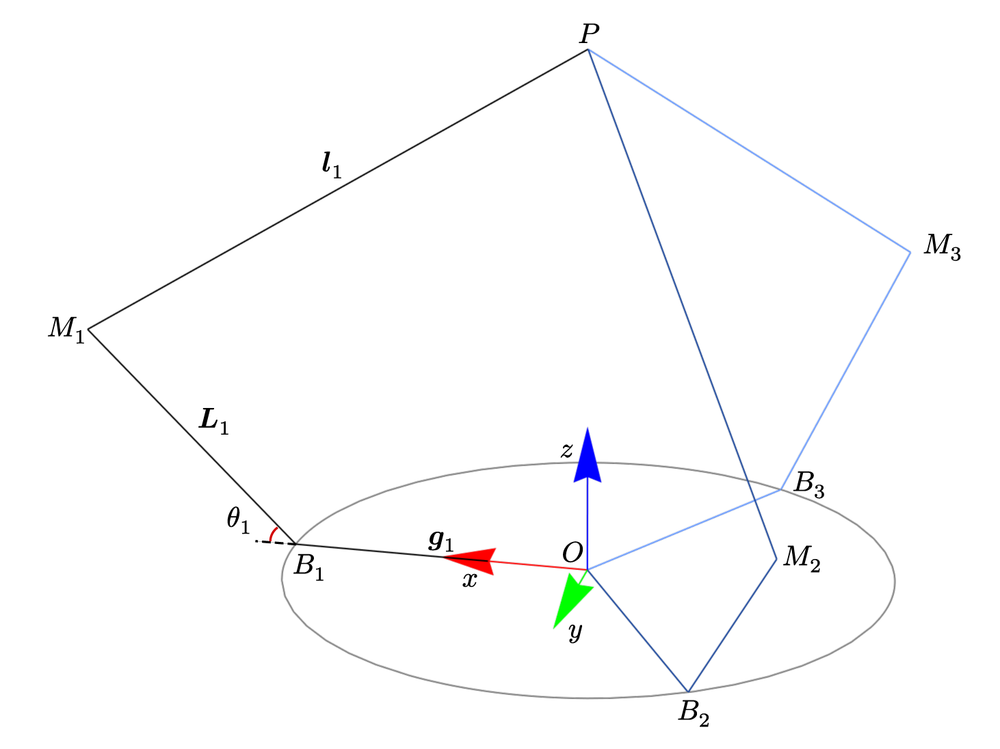
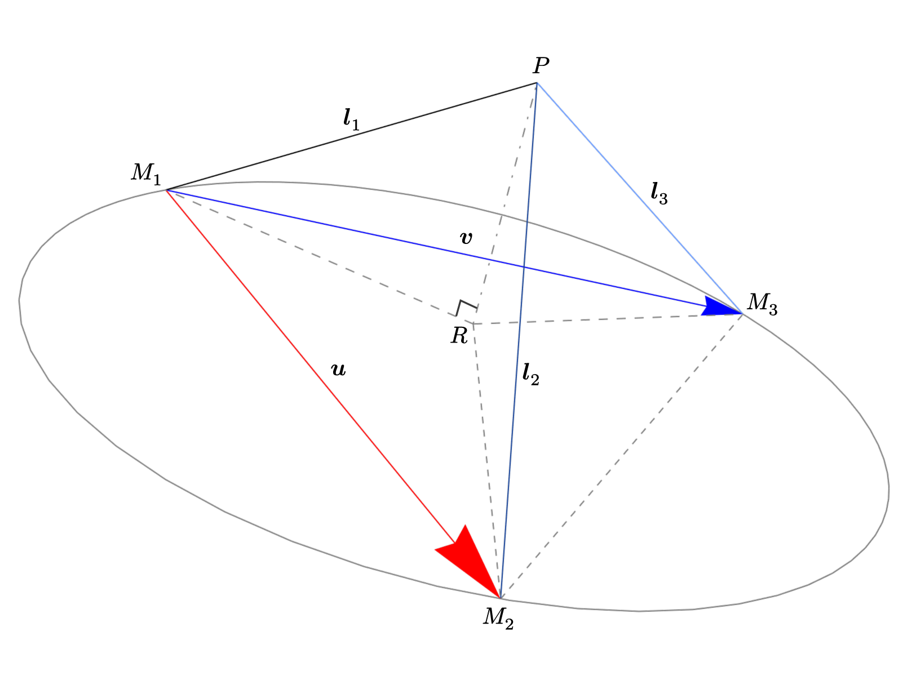
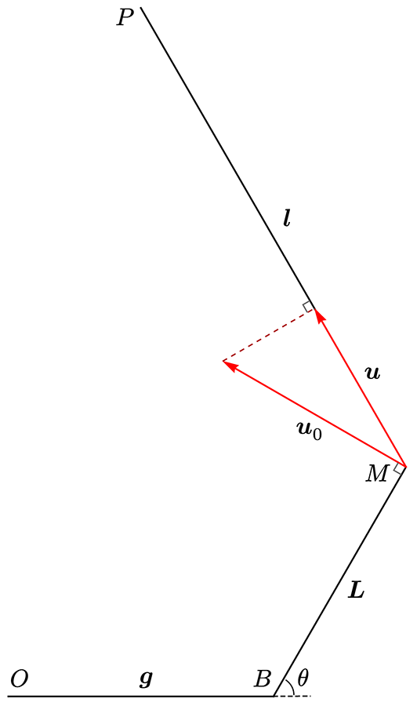

---
tags:
  - 数学
  - 物理
  - 控制
date: 2026-02-17
lastmod: 2026-02-19
title: Delta 机器人的动力学建模
aliases:
  - Delta 机器人的动力学建模
---

# Delta 机器人的动力学建模
[Delta 机器人](https://zh.wikipedia.org/wiki/Delta%E6%A9%9F%E5%99%A8%E4%BA%BA) 是一种三自由度的常用并联型机器人.
由于其特殊设计, 能够保证其顶板始终平行于底板, 只有三个平动自由度而无转动.
这一点很容易证明, 此处不再赘述.
因此我们将按下面的模型讨论



机器人有三个可以独立活动的支部, 编号为 $1$, $2$, $3$, 按右手顺序排列, 彼此相隔 $\frac{2\pi}{3}$.
我们之后的讨论将更多只限于同一个支部, 在不引起误会的情况下, 将省略下标以求简洁.
此时我们讨论的将是适用于三支的通用关系.

约定粗体 $\mathbf{L}$ 代表向量, 非粗体的相同字母代表其模长 $L := \|\mathbf{L}\|$.
在模型中, $L_i$, $i = 1,2,3$ 都是等长的, 因此都记为 $L$; $g$ 与 $l$ 同理.
单位坐标轴方向为 $\hat{\mathbf{i}}$, $\hat{\mathbf{j}}$, $\hat{\mathbf{k}}$; $\hat{\cdot}$ 表示归一化.
$P$ 为关心的末端位置.

## 正向运动学
正向运动学解决的问题是如何通过已知的广义坐标 $\theta_i$, $i = 1,2,3$ 来得到 $P$ 的位置.
我们将从底部开始, 逐步地依次求解 $B$, $M$ 直到 $P$ 的位置.

### 中途向量
$\mathbf{g}$ 与 $B$ 的求解是极为简单的.
记方位角 $\phi$ 为三支在水平面上的偏角, 有 $\phi_1 = 0$, $\phi_2 = \frac{2\pi}{3}$, $\phi_3 = \frac{4\pi}{3}$.
于是
$$\mathbf{g} = g ~ (\hat{\mathbf{i}} \cos{\phi} + \hat{\mathbf{j}} \sin{\phi})$$

因为 $M$ 始终在 $\hat{\mathbf{k}}$ 与 $\mathbf{g}$ 张成的平面上, 使用这两个向量作为基底来表示, 注意归一化.
$$\mathbf{L} = L ~ (\hat{\mathbf{g}} \cos{\theta} + \hat{\mathbf{k}} \sin{\theta})$$

现在我们已经可以求出 $M_i$ 的位置了.
为了进一步求出 $\mathbf{l}_i$ 以得到 $P$ 的位置, 注意到 $l_i$ 都相等, 因此 $\mathbf{l}_i$ 为圆锥 $P-\odot{M_1 M_2 M_3}$ 的母线;
$P$ 为顶点.
圆锥的高 $PR$ 垂直于底面; $R$ 为三角形 $M_1 M_2 M_3$ 的外心.
我们将要利用这一几何关系, 首先求出 $R$ 的位置, 而后计算向量 $\overrightarrow{RP}$, 进而得到所求点 $P$.


### 三角形外心
首先来解决求已知三角形外心位置的问题.

顶点信息包含在向量 $\mathbf{u}$ 与 $\mathbf{v}$ 中, 并且保证 $\mathbf{u}$, $\mathbf{v}$, $\mathbf{n}$ 是按右手排列的, 即 $\mathbf{n} = \mathbf{u} \times \mathbf{v}$, $\mathbf{n}$ 为圆锥的高所在的方向.
可以找到 $\{\mathbf{u}, \mathbf{v}\}$ 的一组对偶向量 $\{\mathbf{u}_\perp, \mathbf{v}_\perp\}$ 满足 $\mathbf{u} \cdot \mathbf{u}_\perp = \mathbf{u}^T \mathbf{u}_\perp = 0$, $\mathbf{v} \cdot \mathbf{v}_\perp = 0$, 只需令 $\mathbf{u}_\perp = \mathbf{u} \times \hat{\mathbf{n}}$, $\mathbf{v}_\perp = \mathbf{v} \times \hat{\mathbf{n}}$.

此时 $\{\mathbf{u}, \mathbf{u}_\perp\}$ 与 $\{\mathbf{v}, \mathbf{v}_\perp\}$ 分别构成平面的基, 可以将外心坐标 $\mathbf{r}$ 写为 $\mathbf{r} = \frac{1}{2} \mathbf{u} + \lambda \mathbf{u}_\perp = \frac{1}{2} \mathbf{v} + \mu \mathbf{v}_\perp$, 移项得 $\frac{1}{2} (\mathbf{u} - \mathbf{v}) = \mu \mathbf{v}_\perp - \lambda \mathbf{u}_\perp = (\mathbf{u}_\perp, \mathbf{v}_\perp) (-\lambda, \mu)^T$.
令 $A := (\mathbf{u}_\perp, \mathbf{v}_\perp)$, 有方程
$$A \begin{pmatrix}
-\lambda \\
\mu \\
\end{pmatrix} = \frac{1}{2} (\mathbf{u} - \mathbf{v})$$
因为 $\mathbf{u}$ 与 $\mathbf{v}$ 都是三维矢量, 这个方程是超定的, 但是我们可以转换为最小二乘问题
$$A^T A \begin{pmatrix}
  -\lambda \\
  \mu \\
\end{pmatrix} = \frac{1}{2} A^T (\mathbf{u} - \mathbf{v})$$
这就变成了适定方程, 可以求解.

注意到 $\|\mathbf{u}_\perp\| = \|\mathbf{u}\|$, 因为 $\mathbf{u}$ 与 $\hat{\mathbf{n}}$ 是正交的; $\mathbf{u}^T A = (\mathbf{u}^T \mathbf{u}_\perp, \mathbf{u}^T \mathbf{v}_\perp) = (0, \mathbf{u} \cdot (\mathbf{v} \times \hat{\mathbf{n}})) = (0, n)$; $\mathbf{v}^T A = (-n, 0)$, 可得
$$\begin{align}
A^T (\mathbf{u} - \mathbf{v}) &= ((\mathbf{u} - \mathbf{v})^T A)^T \\
  &= (\mathbf{u}^T A - \mathbf{v}^T A)^T \\
  &= (n, n)^T \\
  &= n ~ \mathbf{1}
\end{align}$$

$$\begin{align}
A^T A &= \begin{pmatrix}
  \mathbf{u}^T_\perp \\
  \mathbf{v}^T_\perp \\
\end{pmatrix} (\mathbf{u}_\perp, \mathbf{v}_\perp) \\
  &= \begin{pmatrix}
    u^2 & \mathbf{u} \cdot \mathbf{v} \\
    \mathbf{u} \cdot \mathbf{v} & v^2 \\
  \end{pmatrix}
\end{align}$$

方程改写为
$$\begin{pmatrix}
  u^2 & \mathbf{u} \cdot \mathbf{v} \\
  \mathbf{u} \cdot \mathbf{v} & v^2 \\
\end{pmatrix} \begin{pmatrix}
-\lambda \\
\mu
\end{pmatrix} = \frac{1}{2} n \; \mathbf{1} = S \; \mathbf{1}$$
其中 $S$ 为三角形面积 $S := \frac{1}{2} \|\mathbf{u} \times \mathbf{v}\| = \frac{1}{2} n$.

使用*克莱姆法则*求解 $\lambda$, 有
$$\begin{align}
-\lambda &= \begin{vmatrix}
  S & \mathbf{u} \cdot \mathbf{v} \\
  S & v^2 \\
\end{vmatrix} \Big/ \begin{vmatrix}
  u^2 & \mathbf{u} \cdot \mathbf{v} \\
  \mathbf{u} \cdot \mathbf{v} & v^2 \\
\end{vmatrix} \\
  &= \frac{S ~ (v^2 - \mathbf{u} \cdot \mathbf{v})}{u^2 v^2 - (\mathbf{u} \cdot \mathbf{v})^2} \\
  &= \frac{S ~ (v^2 - \mathbf{u} \cdot \mathbf{v})}{\|\mathbf{u} \times \mathbf{v}\|^2} \\
  &= \frac{S ~ (v^2 - \mathbf{u} \cdot \mathbf{v})}{4 S^2}
\end{align}$$
即
$$ \lambda = \frac{\mathbf{u} \cdot \mathbf{v} - v^2}{4 S}$$

将这一结果代入 $\mathbf{r}$ 的表达式中, 可得
$$\begin{align}
\mathbf{r} = \frac{1}{2} \mathbf{u} + \lambda \mathbf{u}_\perp &= \frac{1}{2} \mathbf{u} + \frac{\mathbf{u} \cdot \mathbf{v} - v^2}{4 S} \; (\mathbf{u} \times \frac{\mathbf{u} \times \mathbf{v}}{n}) \\
  &= \frac{1}{2} \mathbf{u} + \frac{\mathbf{u} \cdot \mathbf{v} - v^2}{4 S} \; \frac{1}{2S} \; ((\mathbf{u} \cdot \mathbf{v}) \, \mathbf{u} - u^2 \mathbf{v}) \\
  &= \frac{1}{2} \mathbf{u} + \frac{1}{8S^2} \; (\mathbf{u} \cdot \mathbf{v} - v^2) \; ((\mathbf{u} \cdot \mathbf{v}) \, \mathbf{u} - u^2 \mathbf{v}) \\
  &= \frac{1}{2} \mathbf{u} + \frac{1}{8S^2} \, ((\mathbf{u} \cdot \mathbf{v})^2 \mathbf{u} - (\mathbf{u} \cdot \mathbf{v}) \, v^2 \mathbf{u} - (\mathbf{u} \cdot \mathbf{v}) \, u^2 \mathbf{v} + u^2 v^2 \mathbf{v}) \\
  &= \frac{1}{8S^2} \, (4S^2 \mathbf{u} + (\mathbf{u} \cdot \mathbf{v})^2 \mathbf{u} - (\mathbf{u} \cdot \mathbf{v})(v^2 \mathbf{u} + u^2 \mathbf{v}) + u^2 v^2 \mathbf{v}) \\
  &= \frac{1}{8S^2} \, (u^2 v^2 (\mathbf{u} + \mathbf{v}) - (\mathbf{u} \cdot \mathbf{v})(v^2 \mathbf{u} + u^2 \mathbf{v}))
\end{align}$$

### 圆锥顶点
$R$ 点的坐标利用上面的公式可以写为
$$R = M_1 + \mathbf{r}(M_2 - M_1, M_3 - M_1)$$
其中 $\mathbf{r}(\mathbf{u}, \mathbf{v}) = \mathbf{r}$.

此时 $RP$ 的长 $h$ 也容易求出, $h = \sqrt{l^2 - r^2}$, 则 $\overrightarrow{RP} = h \, \hat{\mathbf{n}}$.

至此已完成正向运动学建模.

### 代码
```python
import numpy as np
from numpy.linalg import norm


gg = 1.
LL = 1.
ll = 2.

def g_(phi):
    """从原点 O 到底盘上关节固定点 B 的向量: g"""
    i = np.array([1.,0,0])
    j = np.array([0,1.,0])
    return gg*(i*np.cos(phi) + j*np.sin(phi))

def L_(g: np.ndarray, theta):
    """从 B 到传动机构中途点 M 的向量: L"""
    k = np.array([0,0,1.])
    return LL*((g/norm(g))*np.cos(theta) + k*np.sin(theta))

def l_(u: np.ndarray, v: np.ndarray):
    """从 M 到目标点 P 的向量: l"""
    uu2 = norm(u)**2
    vv2 = norm(v)**2
    n   = np.cross(u, v)
    SS  = norm(n) / 2
    r   = (uu2*vv2*(u+v) - (u@v)*(vv2*u+uu2*v)) / (8*SS**2)
    rr2 = norm(r)**2
    nn  = np.sqrt(ll**2 - rr2)
    n   = (n / norm(n)) * nn
    return r + n


def fk(thetas: np.ndarray):
	"""正运动学

	根据广义坐标: 极角 theta_i 求解终端位置 P,
	theta 按右手顺序排列."""
    phis = 2*np.pi/3*np.array([0.,1.,2.])
    O = np.zeros(3)
    M_s = np.zeros((3,3))
    for i, (phi, theta) in enumerate(zip(phis, thetas)):
        g = g_(phi)
        B = O + g
        L = L_(g, theta)
        M = B + L
        M_s[i] = M
    l = l_(M_s[1]-M_s[0], M_s[2]-M_s[0])
    P = M_s[0] + l
    return P
```

## 反向运动学
普通机器人的逆运动学解算总是比正运动学困难得多, 但 Delta 机器人恰恰是个例外.
反向运动学, 或逆运动学的任务是已知末端 $P$ 的位置, 求解广义坐标, 也就是极角 $\theta_i$.

令 $\mathbf{a} := \overrightarrow{BP} = P - \mathbf{g}$, 显然 $\mathbf{a} - \mathbf{L} = \mathbf{l}$.
两边平方得 $L^2 + a^2 - 2 \; \mathbf{L} \cdot \mathbf{a} = l^2$.
又因为 $\mathbf{L} = L (\hat{\mathbf{k}} \sin{\theta} + \hat{\mathbf{g}} \cos{\theta})$, 有
$$\begin{align}
& 2 \; \mathbf{L} \cdot \mathbf{a} = -(l^2 - L^2 -a^2) \\
= \;& 2L \, \mathbf{a} \cdot \hat{\mathbf{k}} \; \sin{\theta} + 2L \, \mathbf{a} \cdot \hat{\mathbf{g}} \; \cos{\theta}
\end{align}$$

令 $A = 2L \, \mathbf{a} \cdot \hat{\mathbf{k}}$, $B = 2L \, \mathbf{a} \cdot \hat{\mathbf{g}}$, $C = l^2 - L^2 -a^2$, 线性三角方程 $A \sin{\theta} + B \cos{\theta} + C = 0$ 的解即为所求.

### 线性三角方程
形如 $A \sin{x} + B \cos{x} + C = 0$ 的方程称为*线性三角方程* (*Linear Trigonometric Equation*).
求解它的方法有以下几种:

#### 恒等变换
利用恒等变换 $A \sin{x} + B \cos{x} = R \sin{(x + \phi)}$, 其中 $R = \sqrt{A^2+B^2}$, $\cos{\phi} = \frac{A}{R}$, $\sin{\phi} = \frac{B}{R}$.

于是原方程变成 $R \sin{(x+\phi)} + C = 0$, 即 $\sin{(x+\phi)} = -\frac{C}{R}$.
设 $\alpha = \arcsin{(-\frac{C}{R})}$, 则解为 $x + \phi = \alpha$ 或 $x + \phi = \pi - \alpha$.
所以, 在一个周期内, $x = -\varphi + \alpha$ 或 $x = -\varphi + \pi - \alpha$.

#### 正切半角
做换元 $t := \tan\frac{x}{2}$, $\sin x = \frac{2t}{1+t^2}$, $\cos x = \frac{1-t^2}{1+t^2}$.
原方程化为二次方程 $(A - C) \; t^2 + 2B \; t + (A + C) = 0$.
$t$ 很容易解出, 为 $t = \frac{-B \pm \sqrt{B^2+C^2-A^2}}{A-C}$;
再由 $x = 2\arctan t$ 得解.

### 代码
```python
import numpy as np
from numpy.linalg import norm


gg = 1.
LL = 1.
ll = 2.

def solve_lte(A, B, C):
    """解线性三角方程 (Linear Trigonometric Equation)
    `A sin(x) + B cos(x) + C = 0`

    当无解 (解不为实数) 时抛出一个 `ComplexWarning` 异常"""
    delta = A**2 + B**2 - C**2
    if delta < 0:
        raise np.exceptions.ComplexWarning
    # 另一个解:
    # np.arctan2(-A*C + np.sign(A)*B*np.sqrt(delta), -B*C - np.sign(A)*A*np.sqrt(delta))
    return np.arctan2(-np.sign(A)*A*C - B*np.sqrt(delta), -np.sign(A)*B*C + A*np.sqrt(delta))


def ik(P: np.ndarray, phi):
    """逆运动学

    找到目标点移动到指定位置 P 时, 方位角为 phi 的一支应该具有的极角 theta.
    """
    g  = g_(phi)
    k  = np.array([0,0,1.])
    a  = P - g
    aa = norm(a)
    if aa > ll + LL:
        raise ValueError(P)
    g_h = g/gg
    return solve_lte(2*LL*(a@k), 2*LL*(a@g_h), ll**2-aa**2-LL**2)
```

## 动力学
动力学的中心问题在于求出雅可比矩阵, 它可以建立广义速度与末端速度的关系, 进一步可以得出力矩到末端力的映射.
结合上面运动学建模, 可以获取我们关系的末端全部信息, 包括力, 位置与速度.

令末端 $P$ 的位置为 $\mathbf{p}$, 广义坐标 $\mathbf{\theta} = (\theta_1, \theta_2, \theta_3)^T$, 所需的雅可比矩阵为 $J = \frac{\partial \mathbf{p}}{\partial \mathbf{\theta}}$, 即
$$\mathrm{d} \mathbf{p} = J \, \mathrm{d} \mathbf{\theta}$$
也即
$$\mathbf{v} = J \, \dot{\mathbf{\theta}}$$
其中 $\mathbf{v}$ 表示末端速度, $\dot{\mathbf{\theta}}$ 表示对 $\mathbf{\theta}$ 求导.

对于我们讨论的非冗余 Delta 机构, 其末端自由度与广义坐标维度相等, 这意味着在非退化位形下 $J$ 满秩.
因此, 任意满足 $\dot{\mathbf{\theta}} \rightarrow \mathbf{v}$ 的线性映射都唯一是 $J$, 我们只需找到**速度是如何从起始端传递到末端**即可求出 $J$.
对于这种末端位置高度非形式化的机构, 求微分非常复杂, 几乎不可能求出, 上面的讨论给出了另一种求解 $J$ 的方式.
回到我们关心的 Delta 机器人, 只需做速度分解即可.



主动臂 $BM$ 转动在 $M$ 点产生的速度为 $\mathbf{u}_0$, 令 $\theta$ 的正方向为右手方向 (指向纸面之外), 则
$$\mathbf{u}_0 = \mathbf{\omega} \times \mathbf{L}$$
其中 $\mathbf{\omega} = \dot{\theta} \, (\mathbf{g} \times \mathbf{L})^\wedge$, $(\cdot)^\wedge$ 表示归一化.

进一步, 通过从动杆 $MP$ 传递到末端的速度为 $\mathbf{u}$, 它是 $\mathbf{u}_0$ 在 $\mathbf{l}$ 上的投影, 即
$$\mathbf{u} = \hat{\mathbf{l}} \, \hat{\mathbf{l}}^T \mathbf{u}_0$$
即
$$\mathbf{u} = L \dot{\theta} \, (\hat{\mathbf{l}} \cdot  \hat{\mathbf{L}}_\perp) \, \hat{\mathbf{l}}$$
其中 $\hat{\mathbf{L}}_\perp := \hat{\mathbf{k}} \cos\theta - \hat{\mathbf{g}} \sin\theta$.

三个从动杆上的速度在非退化位形下是线性无关的, 于是它们构成末端速度空间的一组基 $\{\mathbf{u}_i\}$, 每个 $\mathbf{v}$ 都是它们的线性组合, 即有
$$\mathbf{v} = J \, \dot{\mathbf{\theta}} = \sum_i \mathbf{u}_i$$
令 $\mathbf{J} := L  \, (\hat{\mathbf{l}} \cdot  \hat{\mathbf{L}}_\perp) \, \hat{\mathbf{l}}$, 且同样 $\hat{\mathbf{L}}_\perp = \hat{\mathbf{k}} \cos\theta - \hat{\mathbf{g}} \sin\theta$, 则
$$J = (\mathbf{J}_i) = (\mathbf{J}_1, \mathbf{J}_2, \mathbf{J}_3)$$

在实际应用中, 一般已知 $\mathbf{\theta}$ 与 $\mathbf{p}$, 要求 $J$.
此时只需使用很小的开销计算 $\mathbf{L}$ 和 $\mathbf{L}_\perp$, 而后求出 $\mathbf{l} = \mathbf{p} - \mathbf{L} - \mathbf{g}$, 就可应用公式.
$\mathbf{g}$ 和 $\hat{\mathbf{k}}$ 应当是缓存的.
上述提到的向量长度都已知, 因此归一化的开销同样很小.

### 增量更新
考虑一个运动的 Delta 机器人, 我们知道它当前时刻的 $\mathbf{\theta}$ 和 $\mathbf{p}$, 以及 $J$ 和很短时间内广义坐标的改变 $\mathrm{d} \mathbf{\theta}$, 此时末端位置的改变也很容易求出 $\mathrm{d} \mathbf{p} = J \, \mathbf{d} \mathbf{\theta}$.
如何求解 $\mathrm{d} t$ 时间后的雅可比 $J'$?
显然, 从头求解一遍运动学是不划算的, 这一操作过于昂贵, 而且上面的信息已经足够我们求解 $J'$.
此时更好的方法是求出 $\mathrm{d} J$, 而后由 $J' = J + \mathrm{d} J$ 得出 $J'$, 这被称为增量更新.

已知 $\mathrm{d} \mathbf{L}$ 和 $\mathrm{d} \mathbf{p}$, 那么 $\mathrm{d} \mathbf{l} = \mathrm{d} \mathbf{p} - \mathrm{d} \mathbf{L}$, 并且 $\mathrm{d} \mathbf{L} = L \, \mathrm{d}\theta \, \hat{\mathbf{L}}_\perp$, $\mathrm{d} \hat{\mathbf{L}}_\perp = -\hat{\mathbf{L}} \, \mathrm{d} \theta$.
对于 $J$ 的分量 $\mathbf{J}$, 有
$$\begin{align}
\mathrm{d} \mathbf{J} &= L \, ((\frac{\mathrm{d} \mathbf{l}}{l} \cdot \hat{\mathbf{L}}_\perp) \, \hat{\mathbf{l}} +
(\hat{\mathbf{l}} \cdot \mathrm{d} \hat{\mathbf{L}}_\perp) \, \hat{\mathbf{l}} +
(\hat{\mathbf{l}} \cdot \hat{\mathbf{L}}_\perp) \, \frac{\mathrm{d} \mathbf{l}}{l}) \\
  &= L \, ((\frac{1}{l} (\mathrm{d} \mathbf{p} - \mathrm{d}{\mathbf{L}}) \cdot \hat{\mathbf{L}}_\perp) \, \hat{\mathbf{l}} -
  (\hat{\mathbf{l}} \cdot \hat{\mathbf{L}}) \, \mathrm{d} \theta \, \hat{\mathbf{l}} +
  \frac{\|\mathbf{J}\|}{L} \, \frac{\mathrm{d} \mathbf{l}}{l}) \\
  &= L \, (\frac{1}{l} (\mathrm{d} \mathbf{p} \cdot \hat{\mathbf{L}}_\perp - \mathrm{d}{\mathbf{L}} \cdot \hat{\mathbf{L}}_\perp) \, \hat{\mathbf{l}} -
  (\hat{\mathbf{l}} \cdot \hat{\mathbf{L}}) \, \mathrm{d} \theta \, \hat{\mathbf{l}}) +
  \|\mathbf{J}\| \, \frac{\mathrm{d} \mathbf{l}}{l} \\
  &= L \, (\frac{1}{l} (\mathrm{d} \mathbf{p} \cdot \hat{\mathbf{L}}_\perp) \, \hat{\mathbf{l}} -
  \frac{1}{l} (L \, \mathrm{d} \theta) \, \hat{\mathbf{l}} -
  (\hat{\mathbf{l}} \cdot \hat{\mathbf{L}}) \, \mathrm{d} \theta \, \hat{\mathbf{l}}) +
  \|\mathbf{J}\| \, \frac{\mathrm{d} \mathbf{l}}{l} \\
  &= \frac{L}{l} (\mathrm{d} \mathbf{p} \cdot \hat{\mathbf{L}}_\perp) \, \hat{\mathbf{l}} -
  (\frac{L}{l} + \hat{\mathbf{l}} \cdot \hat{\mathbf{L}}) \, L \, \mathrm{d} \theta \, \hat{\mathbf{l}} +
  \|\mathbf{J}\| \, \frac{\mathrm{d} \mathbf{l}}{l} \\
\end{align}$$
这三项的计算都比较廉价.

计算出 $\mathrm{d} \mathbf{J}$ 后, 就有
$$\mathrm{d} J = (\mathrm{d} \mathbf{J}_i)$$
如此一来便可计算 $J' = J + \mathrm{d} J$.